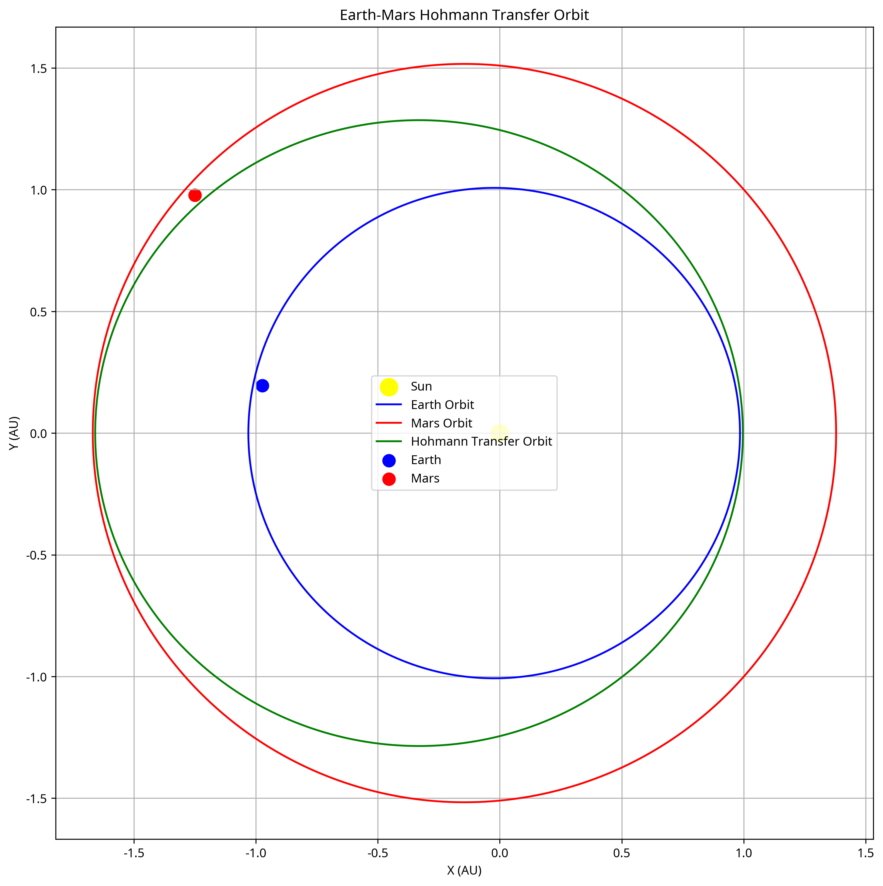

# Optimal Hohmann Transfer Orbit Calculator



## Project Overview

This repository contains a comprehensive analysis and calculation toolset for determining optimal Hohmann transfer orbits between Earth and Mars, based on their positions as of March 2025. Hohmann transfers represent the most fuel-efficient path between two approximately circular, coplanar orbits and are fundamental to interplanetary mission planning.

## Features

- **Accurate Orbital Calculations**: Computes precise orbital parameters for Earth and Mars based on their current positions
- **Delta-V Optimization**: Calculates the minimum delta-v requirements for Earth departure and Mars arrival maneuvers
- **Launch Window Prediction**: Determines optimal launch windows based on planetary alignment
- **Gravitational Perturbation Analysis**: Models the effects of gravitational influences from other planets on the transfer trajectory
- **Detailed Visualizations**: Generates 2D and 3D visualizations of planetary orbits and transfer trajectories
- **Mission Scenario Planning**: Evaluates various mission scenarios with different parameters and constraints

## Implementation Details

The calculator is implemented in Python and utilizes several scientific and numerical computing libraries:

- **astropy**: For planetary ephemeris data and astronomical calculations
- **numpy**: For numerical calculations and array operations
- **matplotlib**: For generating visualizations
- **scipy**: For numerical integration of orbital trajectories

## Repository Structure

```
├── orbital_parameters.py        # Calculates orbital parameters for Earth and Mars
├── hohmann_transfer.py          # Determines Hohmann transfer orbit parameters
├── gravitational_perturbations.py # Analyzes gravitational influences from other planets
├── mission_scenarios.py         # Evaluates different mission scenarios and constraints
├── validate_calculations.py     # Validates calculations against known data
├── comprehensive_report.md      # Detailed analysis report with findings
├── final_documentation.md       # Technical documentation of methodologies
├── hohmann_transfer_orbit.png   # 2D visualization of the transfer orbit
├── hohmann_transfer_orbit_3d.png # 3D visualization of the transfer orbit
├── planetary_orbits.png         # Visualization of Earth and Mars orbits
├── perturbed_trajectory_simplified.png # Visualization of trajectory with perturbations
├── transfer_orbit_comparison.png # Comparison of different transfer strategies
├── delta_v_vs_time.png          # Plot of delta-v requirements vs. launch date
├── mission_scenarios.txt        # Text output of mission scenario evaluations
├── validation_results.txt       # Results of validation against known data
└── todo.md                      # Future improvements and enhancements
```

## Key Findings

Based on March 2025 planetary positions, our analysis shows:

- **Total Delta-V Requirement**: Approximately 5.39 km/s
- **Transfer Time**: About 279 days
- **Next Optimal Launch Window**: Approximately 101 days from March 8, 2025 (Around June 17, 2025)
- **Gravitational Perturbations**: Jupiter has the most significant effect on the trajectory

## Usage Instructions

### Prerequisites

- Python 3.7+
- Required packages: astropy, numpy, matplotlib, scipy

### Installation

1. Clone this repository:
   ```bash
   git clone https://github.com/yourusername/OptimalHohmannTransferOrbit.git
   cd OptimalHohmannTransferOrbit
   ```

2. Install required dependencies:
   ```bash
   pip install numpy matplotlib scipy astropy
   ```

### Running the Calculator

1. To calculate orbital parameters:
   ```bash
   python orbital_parameters.py
   ```

2. To determine Hohmann transfer parameters:
   ```bash
   python hohmann_transfer.py
   ```

3. To analyze gravitational perturbations:
   ```bash
   python gravitational_perturbations.py
   ```

4. To evaluate mission scenarios:
   ```bash
   python mission_scenarios.py
   ```

5. To validate calculations:
   ```bash
   python validate_calculations.py
   ```

## Visualizations

The repository includes several visualizations:

- **Hohmann Transfer Orbit**: Illustrates the optimal transfer orbit from Earth to Mars
- **3D Orbital Visualization**: Shows the 3D representation of orbits with inclination differences
- **Perturbed Trajectory**: Demonstrates how gravitational perturbations affect the ideal trajectory
- **Delta-V vs. Time**: Plots delta-v requirements against different launch dates

## Future Work

Planned enhancements include:

1. Incorporating more sophisticated perturbation models
2. Analyzing bi-elliptic transfers for comparison
3. Implementing gravity assist trajectory planning
4. Developing an interactive web interface for real-time calculations
5. Adding support for other planetary destinations in the solar system

## License

This project is licensed under the MIT License - see the LICENSE file for details.

## Acknowledgments

- NASA JPL for ephemeris data
- The astropy team for their astronomical calculation libraries
- The scientific community for their research on orbital mechanics and interplanetary travel


---

*Note: The calculations in this repository are based on planetary positions as of March 2025. For mission planning with different dates, the parameters should be recalculated accordingly.*
